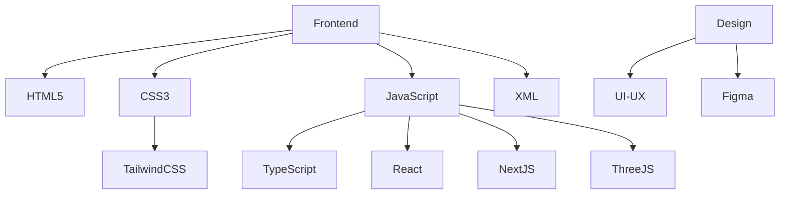
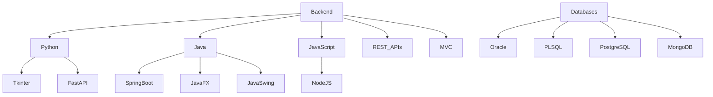
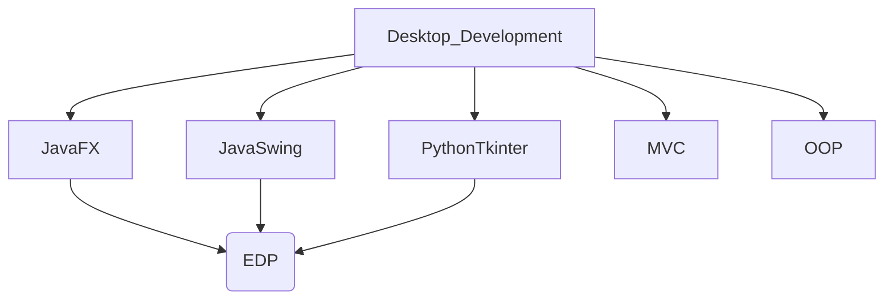
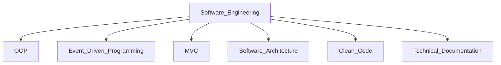
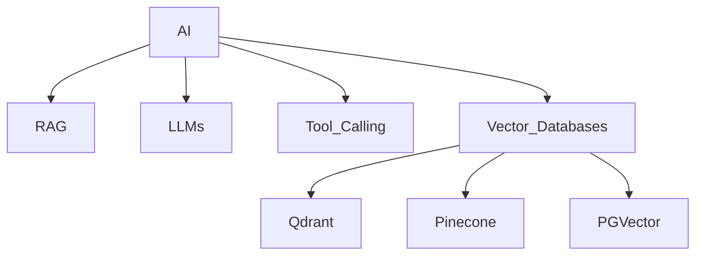
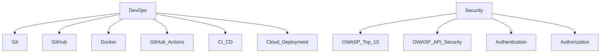
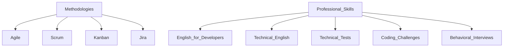

# Developer Knowledge Base

Personal technical documentation and study roadmap repository covering Full Stack development, programming languages, databases, APIs, desktop applications, applied AI, DevOps, OWASP security, Agile methodologies, languages, and technical interview preparation.

## Objective

The goal of this repository is to organize technical knowledge, study notes, practical examples, commands, code snippets, and learning roadmaps related to modern software development.

This repository is designed as a personal knowledge base to support continuous learning, technical interviews, portfolio development, and professional growth as a Full Stack Developer with an interest in applied Artificial Intelligence, software architecture, databases, desktop applications, and professional software engineering practices.

## Main Topics

This repository covers the following areas:

- Full Stack Development
- Programming Languages
- HTML 
- CSS 
- Tailwind 
- JavaScript 
- TypeScript 
- React.js 
- Next.js 
- Python 
- Java 
- C Programming 
- XML
- REST APIs
- FastApi 
- Backend Development
- Spring boot 
- Frontend Development
- Desktop Development
- JavaFX
- Java Swing
- Python Tkinter
- Three.js 
- Blender 
- Databases
- PL/SQL and Oracle Database 
- PostgreSQL 
- MongoDB 
- Applied Artificial Intelligence
- RAG Systems
- Tool Calling
- Vector Databases
- DevOps
- Git and GitHub  
- Docker 
- GitHub Actions
- CI/CD
- Cloud Deployment
- OWASP Security
- Agile Methodologies
- Scrum
- Kanban
- Jira
- Software Architecture
- MVC
- Object-Oriented Programming
- Event-Driven Programming
- UI/UX Design
- Figma 
- English for Developers
- Technical English
- Technical Tests and Interview Preparation

## Skills Map

### Frontend and Design



### Backend and Databases



### Desktop Development



### Software Engineering



### Artificial Intelligence



### DevOps and Security



### Methodologies and Professional Skills



## Repository Structure

```text
developer-knowledge-base/
│
├── README.md
│
├── roadmap/
│   └── README.md
│
├── programming-languages/
│   ├── html/
│   │   └── README.md
│   ├── css/
│   │   └── README.md
│   ├── javascript/
│   │   └── README.md
│   ├── typescript/
│   │   └── README.md
│   ├── python/
│   │   └── README.md
│   ├── java/
│   │   └── README.md
│   ├── c/
│   │   └── README.md
│   └── xml/
│       └── README.md
│
├── databases/
│   ├── oracle-plsql/
│   │   └── README.md
│   ├── postgresql/
│   │   └── README.md
│   └── mongodb/
│       └── README.md
│
├── backend/
│   ├── api-rest/
│   │   └── README.md
│   ├── fastapi/
│   │   └── README.md
│   ├── springboot/
│   │   └── README.md
│   └── node-express/
│       └── README.md
│
├── frontend/
│   ├── react/
│   │   └── README.md
│   ├── nextjs/
│   │   └── README.md
│   ├── tailwind/
│   │   └── README.md
│   └── threejs/
│       └── README.md
│
├── design/
│   ├── ui-ux/
│   │   └── README.md
│   └── figma/
│       └── README.md
│
├── desktop-development/
│   ├── javafx/
│   │   └── README.md
│   ├── java-swing/
│   │   └── README.md
│   └── python-tkinter/
│       └── README.md
│
├── software-engineering/
│   ├── oop/
│   │   └── README.md
│   ├── event-driven-programming/
│   │   └── README.md
│   ├── mvc/
│   │   └── README.md
│   └── software-architecture/
│       └── README.md
│
├── ai/
│   ├── rag/
│   │   └── README.md
│   ├── tool-calling/
│   │   └── README.md
│   └── vector-databases/
│       └── README.md
│
├── devops/
│   ├── git-github/
│   │   └── README.md
│   ├── docker/
│   │   └── README.md
│   ├── github-actions/
│   │   └── README.md
│   └── cloud-deployment/
│       └── README.md
│
├── security/
│   ├── owasp-top-10/
│   │   └── README.md
│   └── owasp-api-security/
│       └── README.md
│
├── methodologies/
│   ├── agile/
│   │   └── README.md
│   ├── scrum/
│   │   └── README.md
│   ├── kanban/
│   │   └── README.md
│   └── jira/
│       └── README.md
│
├── languages/
│   ├── english-for-developers/
│   │   └── README.md
│   └── technical-english/
│       └── README.md
│
├── interview-preparation/
│   ├── technical-tests/
│   │   └── README.md
│   ├── coding-challenges/
│   │   └── README.md
│   ├── system-design-basics/
│   │   └── README.md
│   └── behavioral-interviews/
│       └── README.md
│
└── assets/
    ├── images/
    └── diagrams/
```

## Knowledge Areas

### Roadmap

- [Full Stack + AI Study Roadmap](./roadmap/README.md)

### Programming Languages

- [HTML](./programming-languages/html/README.md)
- [CSS](./programming-languages/css/README.md)
- [JavaScript](./programming-languages/javascript/README.md)
- [TypeScript](./programming-languages/typescript/README.md)
- [Python](./programming-languages/python/README.md)
- [Java](./programming-languages/java/README.md)
- [C Programming](./programming-languages/c/README.md)
- [XML](./programming-languages/xml/README.md)

### Databases

- [Oracle PL/SQL](./databases/oracle-plsql/README.md)
- [PostgreSQL](./databases/postgresql/README.md)
- [MongoDB](./databases/mongodb/README.md)

### Backend

- [REST APIs](./backend/api-rest/README.md)
- [FastAPI](./backend/fastapi/README.md)
- [Spring Boot](./backend/springboot/README.md)
- [Node.js and Express](./backend/node-express/README.md)

### Frontend

- [React](./frontend/react/README.md)
- [Next.js](./frontend/nextjs/README.md)
- [Tailwind CSS](./frontend/tailwind/README.md)
- [Three.js](./frontend/threejs/README.md)

### Design

- [UI/UX Design](./design/ui-ux/README.md)
- [Figma](./design/figma/README.md)

### Desktop Development

- [JavaFX](./desktop-development/javafx/README.md)
- [Java Swing](./desktop-development/java-swing/README.md)
- [Python Tkinter](./desktop-development/python-tkinter/README.md)

### Software Engineering

- [Object-Oriented Programming](./software-engineering/oop/README.md)
- [Event-Driven Programming](./software-engineering/event-driven-programming/README.md)
- [MVC Architecture](./software-engineering/mvc/README.md)
- [Software Architecture](./software-engineering/software-architecture/README.md)

### Artificial Intelligence

- [RAG Systems](./ai/rag/README.md)
- [Tool Calling](./ai/tool-calling/README.md)
- [Vector Databases](./ai/vector-databases/README.md)

### DevOps

- [Git and GitHub](./devops/git-github/README.md)
- [Docker](./devops/docker/README.md)
- [GitHub Actions](./devops/github-actions/README.md)
- [Cloud Deployment](./devops/cloud-deployment/README.md)

### Security

- [OWASP Top 10](./security/owasp-top-10/README.md)
- [OWASP API Security](./security/owasp-api-security/README.md)

### Methodologies

- [Agile](./methodologies/agile/README.md)
- [Scrum](./methodologies/scrum/README.md)
- [Kanban](./methodologies/kanban/README.md)
- [Jira](./methodologies/jira/README.md)

### Languages

- [English for Developers](./languages/english-for-developers/README.md)
- [Technical English](./languages/technical-english/README.md)

### Interview Preparation

- [Technical Tests](./interview-preparation/technical-tests/README.md)
- [Coding Challenges](./interview-preparation/coding-challenges/README.md)
- [System Design Basics](./interview-preparation/system-design-basics/README.md)
- [Behavioral Interviews](./interview-preparation/behavioral-interviews/README.md)

## Recommended Study Order

The recommended order for studying the topics in this repository is:

1. [HTML](./programming-languages/html/README.md)
2. [CSS](./programming-languages/css/README.md)
3. [JavaScript](./programming-languages/javascript/README.md)
4. [XML](./programming-languages/xml/README.md)
5. [Object-Oriented Programming](./software-engineering/oop/README.md)
6. [Event-Driven Programming](./software-engineering/event-driven-programming/README.md)
7. [Git and GitHub](./devops/git-github/README.md)
8. [REST APIs](./backend/api-rest/README.md)
9. [TypeScript](./programming-languages/typescript/README.md)
10. [React](./frontend/react/README.md)
11. [Next.js](./frontend/nextjs/README.md)
12. [Tailwind CSS](./frontend/tailwind/README.md)
13. [UI/UX Design](./design/ui-ux/README.md)
14. [Figma](./design/figma/README.md)
15. [Python](./programming-languages/python/README.md)
16. [FastAPI](./backend/fastapi/README.md)
17. [Java](./programming-languages/java/README.md)
18. [Spring Boot](./backend/springboot/README.md)
19. [JavaFX](./desktop-development/javafx/README.md)
20. [Java Swing](./desktop-development/java-swing/README.md)
21. [Python Tkinter](./desktop-development/python-tkinter/README.md)
22. [C Programming](./programming-languages/c/README.md)
23. [MVC Architecture](./software-engineering/mvc/README.md)
24. [PostgreSQL](./databases/postgresql/README.md)
25. [MongoDB](./databases/mongodb/README.md)
26. [Oracle PL/SQL](./databases/oracle-plsql/README.md)
27. [RAG Systems](./ai/rag/README.md)
28. [Tool Calling](./ai/tool-calling/README.md)
29. [Vector Databases](./ai/vector-databases/README.md)
30. [Three.js](./frontend/threejs/README.md)
31. [Docker](./devops/docker/README.md)
32. [GitHub Actions](./devops/github-actions/README.md)
33. [Cloud Deployment](./devops/cloud-deployment/README.md)
34. [OWASP Top 10](./security/owasp-top-10/README.md)
35. [OWASP API Security](./security/owasp-api-security/README.md)
36. [Agile](./methodologies/agile/README.md)
37. [Scrum](./methodologies/scrum/README.md)
38. [Kanban](./methodologies/kanban/README.md)
39. [Jira](./methodologies/jira/README.md)
40. [English for Developers](./languages/english-for-developers/README.md)
41. [Technical English](./languages/technical-english/README.md)
42. [Technical Tests](./interview-preparation/technical-tests/README.md)
43. [Coding Challenges](./interview-preparation/coding-challenges/README.md)
44. [System Design Basics](./interview-preparation/system-design-basics/README.md)
45. [Behavioral Interviews](./interview-preparation/behavioral-interviews/README.md)

## Progress Status

### Programming Languages

| Topic | Status |
|---|---|
| [HTML](./programming-languages/html/README.md) | ⚪ Pending |
| [CSS](./programming-languages/css/README.md) | ⚪ Pending |
| [JavaScript](./programming-languages/javascript/README.md) | ⚪ Pending |
| [TypeScript](./programming-languages/typescript/README.md) | ⚪ Pending |
| [Python](./programming-languages/python/README.md) | ⚪ Pending |
| [Java](./programming-languages/java/README.md) | ⚪ Pending |
| [C Programming](./programming-languages/c/README.md) | ⚪ Pending |
| [XML](./programming-languages/xml/README.md) | ⚪ Pending |

### Databases

| Topic | Status |
|---|---|
| [Oracle PL/SQL](./databases/oracle-plsql/README.md) | 🟡 In Progress |
| [PostgreSQL](./databases/postgresql/README.md) | ⚪ Pending |
| [MongoDB](./databases/mongodb/README.md) | ⚪ Pending |

### Backend

| Topic | Status |
|---|---|
| [REST APIs](./backend/api-rest/README.md) | ⚪ Pending |
| [FastAPI](./backend/fastapi/README.md) | ⚪ Pending |
| [Spring Boot](./backend/springboot/README.md) | ⚪ Pending |
| [Node.js and Express](./backend/node-express/README.md) | ⚪ Pending |

### Frontend

| Topic | Status |
|---|---|
| [React](./frontend/react/README.md) | ⚪ Pending |
| [Next.js](./frontend/nextjs/README.md) | ⚪ Pending |
| [Tailwind CSS](./frontend/tailwind/README.md) | ⚪ Pending |
| [Three.js](./frontend/threejs/README.md) | ⚪ Pending |

### Design

| Topic | Status |
|---|---|
| [UI/UX Design](./design/ui-ux/README.md) | ⚪ Pending |
| [Figma](./design/figma/README.md) | ⚪ Pending |

### Desktop Development

| Topic | Status |
|---|---|
| [JavaFX](./desktop-development/javafx/README.md) | ⚪ Pending |
| [Java Swing](./desktop-development/java-swing/README.md) | ⚪ Pending |
| [Python Tkinter](./desktop-development/python-tkinter/README.md) | ⚪ Pending |

### Software Engineering

| Topic | Status |
|---|---|
| [Object-Oriented Programming](./software-engineering/oop/README.md) | ⚪ Pending |
| [Event-Driven Programming](./software-engineering/event-driven-programming/README.md) | ⚪ Pending |
| [MVC Architecture](./software-engineering/mvc/README.md) | ⚪ Pending |
| [Software Architecture](./software-engineering/software-architecture/README.md) | ⚪ Pending |

### Artificial Intelligence

| Topic | Status |
|---|---|
| [RAG Systems](./ai/rag/README.md) | ⚪ Pending |
| [Tool Calling](./ai/tool-calling/README.md) | ⚪ Pending |
| [Vector Databases](./ai/vector-databases/README.md) | ⚪ Pending |

### DevOps

| Topic | Status |
|---|---|
| [Git and GitHub](./devops/git-github/README.md) | ⚪ Pending |
| [Docker](./devops/docker/README.md) | ⚪ Pending |
| [GitHub Actions](./devops/github-actions/README.md) | ⚪ Pending |
| [Cloud Deployment](./devops/cloud-deployment/README.md) | ⚪ Pending |

### Security

| Topic | Status |
|---|---|
| [OWASP Top 10](./security/owasp-top-10/README.md) | ⚪ Pending |
| [OWASP API Security](./security/owasp-api-security/README.md) | ⚪ Pending |

### Methodologies

| Topic | Status |
|---|---|
| [Agile](./methodologies/agile/README.md) | ⚪ Pending |
| [Scrum](./methodologies/scrum/README.md) | ⚪ Pending |
| [Kanban](./methodologies/kanban/README.md) | ⚪ Pending |
| [Jira](./methodologies/jira/README.md) | ⚪ Pending |

### Languages

| Topic | Status |
|---|---|
| [English for Developers](./languages/english-for-developers/README.md) | ⚪ Pending |
| [Technical English](./languages/technical-english/README.md) | ⚪ Pending |

### Interview Preparation

| Topic | Status |
|---|---|
| [Technical Tests](./interview-preparation/technical-tests/README.md) | ⚪ Pending |
| [Coding Challenges](./interview-preparation/coding-challenges/README.md) | ⚪ Pending |
| [System Design Basics](./interview-preparation/system-design-basics/README.md) | ⚪ Pending |
| [Behavioral Interviews](./interview-preparation/behavioral-interviews/README.md) | ⚪ Pending |

## Practical Goal

The final goal of this knowledge base is to support the development of complete portfolio projects that demonstrate practical skills across multiple areas of software development.

## Suggested Portfolio Projects

### 1. AI Task Manager / Portfolio Assistant

A Full Stack application that includes:

- User authentication
- REST API
- Frontend dashboard
- PostgreSQL database
- Optional MongoDB integration
- RAG-based document assistant
- Tool Calling
- Vector database integration
- Docker environment
- CI/CD pipeline
- OWASP security checklist
- Agile/Scrum project board
- Technical documentation

### 2. Desktop Banking Application

A desktop application focused on Java and UI development.

Suggested technologies:

- Java
- JavaFX
- Java Swing
- MVC
- OOP
- Event-Driven Programming
- Oracle Database or PostgreSQL

Suggested features:

- Login system
- Customer registration
- Account management
- Transactions
- Balance inquiry
- Basic reports
- Input validation
- GUI event handling

### 3. Python Desktop Management System

A desktop application using Python.

Suggested technologies:

- Python
- Tkinter
- SQLite or PostgreSQL
- MVC
- OOP
- Event-Driven Programming

Suggested features:

- CRUD operations
- Search filters
- User interface forms
- Data validation
- Report generation

### 4. Interactive 3D Web Portfolio

A creative frontend project using 3D web graphics.

Suggested technologies:

- HTML
- CSS
- JavaScript
- React
- Three.js
- UI/UX Design
- Figma

Suggested features:

- 3D landing page
- Interactive portfolio sections
- Project gallery
- Contact form
- Responsive design
- Animations

## How to Use This Repository

Each folder contains a dedicated `README.md` file with focused documentation for a specific topic.

Each topic README should include:

- Theoretical explanation
- Practical examples
- Commands
- Code snippets
- Exercises
- Recommended resources
- Mini projects
- Best practices
- Common interview questions
- Technical test examples when applicable

Start with the [Full Stack + AI Study Roadmap](./roadmap/README.md), then move through each topic depending on your current learning goal.

## Learning Method

For each topic, the recommended learning structure is:

1. Understand the theory.
2. Study the syntax or main concepts.
3. Write basic examples.
4. Build a small practical exercise.
5. Document the topic in the corresponding README.
6. Add common errors and best practices.
7. Add interview questions.
8. Add a mini project or technical test exercise.

## Technical Interview Preparation

This repository also includes a dedicated section for technical interview preparation.

Topics include:

- Programming logic
- Data structures basics
- Algorithms basics
- CRUD exercises
- REST API challenges
- SQL queries
- OOP exercises
- Java technical tests
- Python technical tests
- JavaScript technical tests
- Frontend challenges
- Backend challenges
- Database design exercises
- System design basics
- Behavioral interview preparation
- English interview practice

## Languages

The languages section is focused on improving communication skills for software development.

Main goals:

- Improve English vocabulary for developers
- Practice technical explanations in English
- Prepare for English interviews
- Learn common software development terms
- Practice writing technical documentation in English
- Practice explaining projects, APIs, databases, and architecture

## Author

**Pedro Salazar**

Full Stack Developer in progress with experience in Java, Python, JavaScript, React, Tailwind CSS, SQL, Spring Boot, Git, JavaFX, Java Swing, Tkinter, Three.js, Object-Oriented Programming, Event-Driven Programming, UI development, databases, and applied Artificial Intelligence projects.

## License

This repository is intended for personal learning, technical documentation, and portfolio development.

You may use the content as reference for study and practice.
