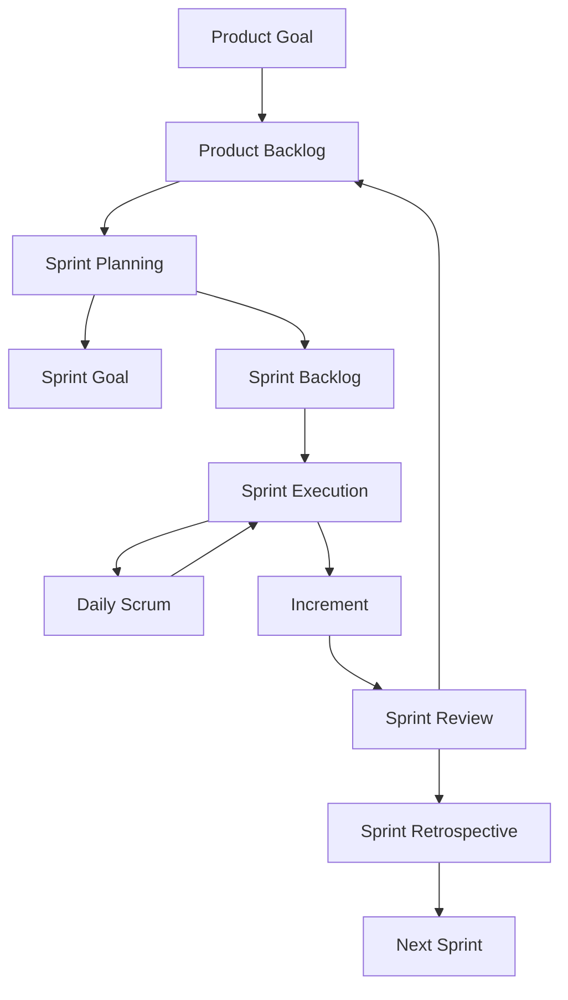

# Scrum Methodology

Documentation and practical study notes about **Scrum**, an Agile framework used to manage complex product development through iterative and incremental delivery.

This module focuses on Scrum fundamentals, Scrum values, empiricism, accountabilities, events, artifacts, commitments, sprint planning, backlog management, user stories, Definition of Done, Jira usage, metrics, common mistakes, practical examples, and technical interview preparation.

This README is part of the `developer-knowledge-base` repository.

Recommended file path:

```text
methodologies/scrum/README.md
```

---

## Objective

The objective of this module is to understand how Scrum works and how it can be applied in software development teams to deliver value continuously.

By the end of this module, the reader should be able to:

- Explain what Scrum is.
- Understand how Scrum relates to Agile.
- Identify Scrum accountabilities.
- Explain Scrum events.
- Understand Scrum artifacts and commitments.
- Create and manage a Product Backlog.
- Write basic user stories.
- Define acceptance criteria.
- Understand Sprint Planning, Daily Scrum, Sprint Review, and Sprint Retrospective.
- Use Scrum concepts in Jira or similar tools.
- Understand common Scrum metrics.
- Prepare for Scrum-related technical and behavioral interviews.

---

## Version Coverage

> Last reviewed: 2026.  
> This README covers Scrum fundamentals based on the official **Scrum Guide 2020**, which remains the current official version of the Scrum Guide.

Main references used for this module:

- The Scrum Guide 2020 by Ken Schwaber and Jeff Sutherland.
- Scrum.org learning resources.
- Atlassian Agile and Scrum practical guides.
- Common Scrum practices used in modern software development teams.

---

## Executive Summary

Scrum is a lightweight framework for managing complex work through short iterations called **Sprints**. It helps teams deliver value incrementally by making work transparent, inspecting progress frequently, and adapting based on evidence.

In software development, Scrum is useful for organizing product work such as REST APIs, frontend features, authentication, dashboards, testing, documentation, and releases.

This README is organized from fundamentals to practical application:

1. Agile and Scrum foundations.
2. Scrum theory, values, team, accountabilities, events, artifacts, and commitments.
3. Practical tools such as user stories, acceptance criteria, Definition of Done, backlog refinement, Scrum boards, Jira, and metrics.
4. Applied examples for REST API and Full Stack projects.
5. Interview preparation and study checklist.

---

## Quick Reference

| Area | Key Idea | Practical Example |
|---|---|---|
| Scrum Theory | Transparency, Inspection, Adaptation | Inspect Sprint progress and adapt the Sprint Backlog |
| Scrum Values | Commitment, Focus, Openness, Respect, Courage | Communicate blockers early and respectfully |
| Scrum Team | Product Owner, Scrum Master, Developers | Cross-functional team delivering one Increment |
| Events | Sprint, Planning, Daily, Review, Retrospective | A 2-week Sprint to deliver task CRUD |
| Artifacts | Product Backlog, Sprint Backlog, Increment | Ordered backlog, Sprint plan, usable feature |
| Commitments | Product Goal, Sprint Goal, Definition of Done | Quality and focus standards for delivery |
| Practical Tools | User stories, acceptance criteria, Jira board | `As a user, I want to create a task...` |
| Metrics | Velocity, burndown, cycle time, lead time | Forecasting and bottleneck detection |

---

## Table of Contents

1. [What Is Scrum?](#what-is-scrum)
2. [Agile vs Scrum](#agile-vs-scrum)
3. [Scrum Theory](#scrum-theory)
4. [Scrum Values](#scrum-values)
5. [Scrum Team](#scrum-team)
6. [Scrum Accountabilities](#scrum-accountabilities)
7. [Product Owner](#product-owner)
8. [Scrum Master](#scrum-master)
9. [Developers](#developers)
10. [Scrum Events](#scrum-events)
11. [The Sprint](#the-sprint)
12. [Sprint Planning](#sprint-planning)
13. [Daily Scrum](#daily-scrum)
14. [Sprint Review](#sprint-review)
15. [Sprint Retrospective](#sprint-retrospective)
16. [Scrum Artifacts](#scrum-artifacts)
17. [Product Backlog](#product-backlog)
18. [Sprint Backlog](#sprint-backlog)
19. [Increment](#increment)
20. [Scrum Commitments](#scrum-commitments)
21. [Scrum Flow](#scrum-flow)
22. [User Stories](#user-stories)
23. [Acceptance Criteria](#acceptance-criteria)
24. [Definition of Done](#definition-of-done)
25. [Definition of Ready](#definition-of-ready)
26. [Backlog Refinement](#backlog-refinement)
27. [Scrum Board](#scrum-board)
28. [Scrum in Jira](#scrum-in-jira)
29. [Scrum Metrics](#scrum-metrics)
30. [Example Sprint](#example-sprint)
31. [Scrum for a REST API Project](#scrum-for-a-rest-api-project)
32. [Scrum for a Full Stack Project](#scrum-for-a-full-stack-project)
33. [Common Scrum Mistakes](#common-scrum-mistakes)
34. [Scrum Anti-Patterns](#scrum-anti-patterns)
35. [Technical Interview Questions](#technical-interview-questions)
36. [Behavioral Interview Questions](#behavioral-interview-questions)
37. [Study Checklist](#study-checklist)
38. [Recommended Resources](#recommended-resources)


---

## What Is Scrum?

**Scrum** is a lightweight Agile framework that helps teams solve complex problems while delivering valuable products incrementally.

Scrum is commonly used in software development, but it can also be applied to other complex projects.

Scrum is based on:

- Iterative work.
- Incremental delivery.
- Transparency.
- Inspection.
- Adaptation.
- Collaboration.
- Continuous improvement.

### Simple explanation

Instead of trying to build an entire product at once, Scrum divides the work into short cycles called **Sprints**.

At the end of each Sprint, the team should produce a usable product increment.

### Example

A team is building a task manager application.

Instead of building everything at once, the team works in Sprints:

| Sprint | Goal | Delivered Increment |
|---:|---|---|
| 1 | User authentication | Login and registration |
| 2 | Task CRUD | Create, read, update, delete tasks |
| 3 | Project management | Create projects and assign tasks |
| 4 | Dashboard | Task statistics and filters |

### Explanation

Each Sprint delivers something useful.  
The product evolves step by step.

---

## Agile vs Scrum

**Agile** is a mindset and set of principles for adaptive software development.

**Scrum** is a framework that applies Agile principles through defined accountabilities, events, artifacts, and commitments.

| Concept | Agile | Scrum |
|---|---|---|
| Type | Mindset / philosophy | Framework |
| Focus | Adaptability and value delivery | Iterative product development |
| Structure | Broad principles | Defined accountabilities, events, artifacts |
| Examples | Agile Manifesto principles | Sprint, Product Backlog, Scrum Team |
| Usage | Guides how teams think | Guides how teams work |

### Example

A team can be Agile by:

- Responding to change.
- Collaborating with customers.
- Delivering working software frequently.

A team uses Scrum by:

- Working in Sprints.
- Managing a Product Backlog.
- Holding Sprint Planning, Daily Scrum, Sprint Review, and Sprint Retrospective.
- Delivering an Increment.

---

## Scrum Theory

Scrum is founded on **empiricism** and **lean thinking**.

### Empiricism

Empiricism means that knowledge comes from experience and decision-making is based on what is observed.

Scrum uses three pillars of empiricism:

| Pillar | Meaning |
|---|---|
| Transparency | Work and progress must be visible |
| Inspection | The team frequently checks progress and results |
| Adaptation | The team adjusts based on what is learned |

### Lean thinking

Lean thinking focuses on reducing waste and maximizing value.

### Example

A team planned to finish 8 backlog items during a Sprint, but by the Daily Scrum they notice that testing is taking longer than expected.

The team inspects the situation and adapts by:

- Reducing scope.
- Pairing developers.
- Asking the Product Owner to clarify priorities.
- Moving lower-priority items back to the Product Backlog.

---

## Scrum Values

Scrum is based on five values:

| Value | Meaning |
|---|---|
| Commitment | The team commits to goals and continuous improvement |
| Focus | The team focuses on Sprint work and goals |
| Openness | The team is transparent about progress and problems |
| Respect | Team members respect each other's skills and perspectives |
| Courage | The team has courage to address difficult issues |

### Practical example

If a developer is blocked, openness means saying:

```text
I am blocked because the API specification is incomplete.
```

Respect means the team does not blame the developer.

Courage means the team discusses the problem honestly.

Focus means the team works together to unblock the Sprint Goal.

---

## Scrum Team

A Scrum Team is a small, cross-functional group of people responsible for delivering product value.

The Scrum Team includes:

- Product Owner
- Scrum Master
- Developers

Scrum does not define traditional sub-teams such as:

- Backend team
- Frontend team
- QA team
- Design team

Instead, the Scrum Team should contain all skills needed to deliver a usable Increment.

### Example Scrum Team

| Person | Main Skills | Scrum Accountability |
|---|---|---|
| Ana | Product strategy, business analysis | Product Owner |
| Luis | Facilitation, Agile coaching | Scrum Master |
| Marta | Backend, databases | Developer |
| Carlos | Frontend, UI | Developer |
| Pedro | Testing, DevOps | Developer |

---

## Scrum Accountabilities

The Scrum Guide defines three accountabilities:

1. Product Owner
2. Scrum Master
3. Developers

The term **accountability** is preferred because Scrum focuses on responsibility and ownership rather than job titles.

---

## Product Owner

The **Product Owner** is accountable for maximizing the value of the product.

Main responsibilities:

- Define and communicate the Product Goal.
- Manage the Product Backlog.
- Order Product Backlog items.
- Clarify requirements.
- Represent stakeholders.
- Ensure the team understands priorities.

### Example

A Product Owner for a task manager app may prioritize:

| Priority | Product Backlog Item |
|---:|---|
| 1 | User login |
| 2 | Create task |
| 3 | Update task |
| 4 | Delete task |
| 5 | Dashboard analytics |

### Explanation

The Product Owner decides what is most valuable to build first.

---

## Scrum Master

The **Scrum Master** is accountable for establishing Scrum as defined in the Scrum Guide.

Main responsibilities:

- Coach the team in Scrum.
- Help remove impediments.
- Facilitate Scrum events when needed.
- Help the Product Owner manage the backlog effectively.
- Help the organization understand Scrum.
- Promote continuous improvement.

### Example

If the team is blocked because test environments are unstable, the Scrum Master helps remove the impediment by:

- Making the blocker visible.
- Coordinating with DevOps.
- Helping the team find a temporary workaround.
- Encouraging process improvement.

---

## Developers

**Developers** are the people in the Scrum Team who create the product Increment.

Developers are accountable for:

- Creating a plan for the Sprint.
- Maintaining the Sprint Backlog.
- Delivering usable Increments.
- Ensuring quality.
- Adapting the plan every day.

### Example

In a software team, Developers may include:

- Backend developers
- Frontend developers
- QA engineers
- UI designers
- DevOps engineers
- Data engineers

In Scrum, all of them are considered Developers if they contribute to the product Increment.

---

## Scrum Events

Scrum has five official events:

1. The Sprint
2. Sprint Planning
3. Daily Scrum
4. Sprint Review
5. Sprint Retrospective

These events create regular opportunities for transparency, inspection, and adaptation.

---

## The Sprint

A **Sprint** is a fixed-length iteration where the Scrum Team works toward a Sprint Goal.

Common Sprint lengths:

- 1 week
- 2 weeks
- 3 weeks
- 1 month maximum

### Example

```text
Sprint duration: 2 weeks
Sprint Goal: Allow users to create and manage tasks
```

### Expected Sprint outcome

At the end of the Sprint, the team delivers:

- Task creation endpoint
- Task list endpoint
- Task update endpoint
- Basic frontend task form
- Tests for task endpoints

---

## Sprint Planning

Sprint Planning starts the Sprint.

The Scrum Team answers:

1. Why is this Sprint valuable?
2. What can be done this Sprint?
3. How will the selected work get done?

### Inputs

- Product Backlog
- Product Goal
- Team capacity
- Previous Sprint results
- Technical constraints

### Outputs

- Sprint Goal
- Selected Product Backlog items
- Sprint Backlog
- Initial plan

### Example Sprint Planning result

| Item | Description | Estimate |
|---|---|---:|
| API-01 | Create task endpoint | 3 pts |
| API-02 | Get task list endpoint | 2 pts |
| API-03 | Update task endpoint | 3 pts |
| FE-01 | Task form UI | 3 pts |
| QA-01 | Endpoint tests | 2 pts |

Sprint Goal:

```text
Users can create, view, and update tasks from the application.
```

---

## Daily Scrum

The **Daily Scrum** is a short daily event for Developers.

Recommended duration:

```text
15 minutes
```

Purpose:

- Inspect progress toward the Sprint Goal.
- Adapt the Sprint Backlog.
- Coordinate the next 24 hours of work.

### Common questions

The classic three questions are often used:

1. What did I do yesterday?
2. What will I do today?
3. Do I have any blockers?

However, the main focus should be progress toward the Sprint Goal, not status reporting.

### Example

```text
Yesterday: I implemented POST /tasks.
Today: I will add validation and tests.
Blocker: I need confirmation about priority values.
```

### Expected outcome

After the Daily Scrum, the team may update the Sprint Backlog:

| Task | Status Before Daily | Status After Daily |
|---|---|---|
| Create task endpoint | In Progress | In Review |
| Add validation | To Do | In Progress |
| Confirm priority values | Blocked | Product Owner follow-up |

---

## Sprint Review

The **Sprint Review** happens near the end of the Sprint.

Purpose:

- Inspect the Increment.
- Gather feedback.
- Discuss progress toward the Product Goal.
- Adapt the Product Backlog if needed.

### Example Sprint Review agenda

1. Review Sprint Goal.
2. Demonstrate completed work.
3. Discuss what was not completed.
4. Collect stakeholder feedback.
5. Update Product Backlog.

### Example feedback

Stakeholder feedback:

```text
The task form works, but users need a due date field.
```

Product Backlog adaptation:

| New Backlog Item | Priority |
|---|---:|
| Add due date to tasks | High |
| Add task reminders | Medium |

---

## Sprint Retrospective

The **Sprint Retrospective** is the final event of the Sprint.

Purpose:

- Inspect how the Sprint went.
- Identify improvements.
- Create actionable improvement items.

### Common retrospective format

| Question | Example Answer |
|---|---|
| What went well? | API and frontend collaboration improved |
| What did not go well? | Testing started too late |
| What can we improve? | Add test tasks earlier in the Sprint |

### Expected output

| Improvement Action | Owner | Next Sprint Action |
|---|---|---|
| Add testing tasks during Sprint Planning | Team | Include QA tasks in Sprint Backlog |
| Clarify acceptance criteria earlier | Product Owner | Refine top backlog items before planning |

---

## Scrum Artifacts

Scrum has three official artifacts:

1. Product Backlog
2. Sprint Backlog
3. Increment

Artifacts make work and value transparent.

---

## Product Backlog

The **Product Backlog** is an ordered list of everything that may be needed in the product.

It contains:

- Features
- Bug fixes
- Technical improvements
- Research tasks
- Refactoring work
- Security tasks

### Example Product Backlog

| Priority | ID | Item | Type | Estimate |
|---:|---|---|---|---:|
| 1 | AUTH-01 | User registration | Feature | 5 |
| 2 | AUTH-02 | User login | Feature | 5 |
| 3 | TASK-01 | Create task | Feature | 3 |
| 4 | TASK-02 | List tasks | Feature | 3 |
| 5 | SEC-01 | Validate JWT tokens | Security | 3 |
| 6 | DOC-01 | Add Swagger documentation | Documentation | 2 |

### Explanation

The Product Backlog is dynamic.  
It changes as the team learns more about users, risks, and business priorities.

---

## Sprint Backlog

The **Sprint Backlog** contains:

- The Sprint Goal.
- Selected Product Backlog items.
- A plan for delivering the Increment.

### Example Sprint Backlog

Sprint Goal:

```text
Users can authenticate and access their task list.
```

| Item | Task | Status |
|---|---|---|
| AUTH-01 | Create registration endpoint | In Progress |
| AUTH-02 | Create login endpoint | To Do |
| SEC-01 | Validate JWT token | To Do |
| TASK-02 | Create task list endpoint | To Do |

### Explanation

The Sprint Backlog is owned and adapted by the Developers during the Sprint.

---

## Increment

An **Increment** is the usable product result created during a Sprint.

An Increment must meet the **Definition of Done**.

### Example Increment

At the end of the Sprint, the Increment includes:

- Registration endpoint
- Login endpoint
- JWT token validation
- Task list endpoint
- Unit tests
- Swagger documentation

### Expected result

The team can demonstrate:

```text
A user can register, log in, receive a token, and view their task list.
```

---

## Scrum Commitments

Each Scrum artifact has a commitment:

| Artifact | Commitment |
|---|---|
| Product Backlog | Product Goal |
| Sprint Backlog | Sprint Goal |
| Increment | Definition of Done |

### Product Goal

The Product Goal describes a future state of the product.

Example:

```text
Build a task management platform that helps developers organize projects, tasks, and technical documentation.
```

### Sprint Goal

The Sprint Goal describes the objective of the Sprint.

Example:

```text
Allow users to create and manage tasks securely.
```

### Definition of Done

The Definition of Done defines quality standards required for work to be considered complete.

Example:

```text
A feature is done when it is coded, reviewed, tested, documented, and merged into the main branch.
```

---

## Scrum Flow



### Explanation

Scrum is cyclical.  
Each Sprint produces learning and value that influence the next Sprint.

---

## User Stories

A **user story** is a simple way to describe a feature from the user's perspective.

Common format:

```text
As a [type of user],
I want [some goal],
so that [some benefit].
```

### Example

```text
As a registered user,
I want to create a task,
so that I can organize my work.
```

### Example user stories for a task manager

| ID | User Story |
|---|---|
| US-01 | As a user, I want to register so that I can create an account. |
| US-02 | As a user, I want to log in so that I can access my private tasks. |
| US-03 | As a user, I want to create tasks so that I can organize my work. |
| US-04 | As a user, I want to mark tasks as completed so that I can track progress. |
| US-05 | As an admin, I want to view users so that I can manage the platform. |

---

## Acceptance Criteria

Acceptance criteria define what must be true for a user story to be accepted.

### Example user story

```text
As a user,
I want to create a task,
so that I can organize my work.
```

### Acceptance criteria

```text
Given I am authenticated
When I send a valid task title and description
Then the system creates the task
And the task is associated with my user account
And the response returns the task ID
```

### Table format

| Scenario | Given | When | Then |
|---|---|---|---|
| Create valid task | User is authenticated | User submits valid task data | Task is created |
| Missing title | User is authenticated | User submits empty title | Validation error is returned |
| Unauthenticated user | User has no token | User submits task data | 401 Unauthorized is returned |

---

## Definition of Done

The **Definition of Done** is a shared quality standard.

A Product Backlog item is done only when it satisfies the Definition of Done.

### Example Definition of Done for software

A backlog item is done when:

- Code is implemented.
- Code is reviewed.
- Unit tests pass.
- Integration tests pass when applicable.
- Acceptance criteria are met.
- No critical bugs remain.
- Documentation is updated.
- API endpoints are documented.
- Security checks are completed when applicable.
- The work is merged into the main branch.

### Example

Backlog item:

```text
Create task endpoint
```

Done checklist:

| Requirement | Completed |
|---|---|
| Endpoint implemented | Yes |
| Request validation added | Yes |
| Unit tests added | Yes |
| Swagger documentation updated | Yes |
| Code reviewed | Yes |
| Merged into main | Yes |

Result:

```text
The item is Done.
```

---

## Definition of Ready

The **Definition of Ready** is not an official Scrum commitment, but many teams use it as a practical checklist before selecting work for a Sprint.

### Example Definition of Ready

A backlog item is ready when:

- The user story is clear.
- Acceptance criteria are defined.
- Dependencies are identified.
- The item is small enough for one Sprint.
- The Product Owner can explain the expected value.
- The team understands the technical approach.

### Example

Not ready:

```text
Improve dashboard.
```

Ready:

```text
As a user,
I want to filter dashboard tasks by status,
so that I can focus on pending work.
```

Acceptance criteria:

- Filter by pending.
- Filter by completed.
- Clear filter option.
- Empty state when no tasks match.

---

## Backlog Refinement

Backlog Refinement is the activity of improving Product Backlog items.

It may include:

- Clarifying requirements.
- Splitting large items.
- Adding acceptance criteria.
- Estimating work.
- Reordering items.
- Removing outdated items.

### Before refinement

```text
Build notifications.
```

### After refinement

| ID | Refined Item |
|---|---|
| NOTIF-01 | Email notification when a task is assigned |
| NOTIF-02 | In-app notification when a task is due soon |
| NOTIF-03 | Notification settings per user |

### Explanation

Refinement makes backlog items clearer and easier to plan.

---

## Scrum Board

A Scrum board visualizes Sprint work.

### Common columns

| Column | Meaning |
|---|---|
| To Do | Work selected but not started |
| In Progress | Work currently being developed |
| In Review | Work waiting for review |
| Testing | Work being tested |
| Done | Work completed according to Definition of Done |

### Example board

| To Do | In Progress | In Review | Testing | Done |
|---|---|---|---|---|
| Login endpoint | Task creation endpoint | Registration UI | JWT tests | Database schema |
| Task list endpoint |  |  |  | Project setup |

### Explanation

The board helps the team inspect progress and identify bottlenecks.

---

## Scrum in Jira

Jira is commonly used to manage Scrum work.

### Common Jira elements

| Jira Element | Scrum Concept |
|---|---|
| Epic | Large body of work |
| Story | Product Backlog item |
| Task | Technical work |
| Bug | Defect |
| Sprint | Sprint |
| Board | Sprint Backlog visualization |
| Backlog | Product Backlog |
| Version / Release | Product release |

### Example Jira hierarchy

```text
Epic: Task Management
├── Story: Create task
│   ├── Task: Create database table
│   ├── Task: Create REST endpoint
│   └── Task: Add frontend form
├── Story: List tasks
└── Story: Complete task
```

### Example workflow

```text
To Do → In Progress → Code Review → Testing → Done
```

---

## Scrum Metrics

Scrum does not require a fixed set of metrics, but teams often use metrics to improve transparency and forecasting.

### Common metrics

| Metric | Purpose |
|---|---|
| Velocity | Amount of work completed per Sprint |
| Burndown Chart | Remaining work during the Sprint |
| Burnup Chart | Completed work over time |
| Cycle Time | Time from work start to completion |
| Lead Time | Time from request to delivery |
| Sprint Goal Success | Whether the Sprint Goal was achieved |
| Escaped Defects | Bugs found after release |

### Velocity example

| Sprint | Completed Story Points |
|---:|---:|
| Sprint 1 | 18 |
| Sprint 2 | 21 |
| Sprint 3 | 20 |

Average velocity:

```text
(18 + 21 + 20) / 3 = 19.67 story points
```

### Important warning

Velocity should be used for planning, not for pressuring the team.

Bad use:

```text
Your velocity must increase every Sprint.
```

Better use:

```text
Based on recent velocity, what amount of work can we realistically select?
```

---

## Example Sprint

### Product Goal

```text
Create a simple task manager for developers.
```

### Sprint Goal

```text
Users can create and view their tasks.
```

### Selected Product Backlog Items

| ID | Item | Estimate |
|---|---|---:|
| TASK-01 | Create task endpoint | 3 |
| TASK-02 | List tasks endpoint | 3 |
| FE-01 | Create task form | 3 |
| FE-02 | Task list UI | 3 |
| QA-01 | Add API tests | 2 |

### Sprint Backlog

| Task | Owner | Status |
|---|---|---|
| Design task table | Developer | Done |
| Implement POST /tasks | Developer | In Progress |
| Implement GET /tasks | Developer | To Do |
| Build task form | Developer | To Do |
| Add API tests | Developer | To Do |

### End of Sprint Increment

| Feature | Status |
|---|---|
| Task creation API | Done |
| Task list API | Done |
| Task form UI | Done |
| Task list UI | Done |
| API tests | Done |

### Sprint Review result

Stakeholders confirm that users can create and view tasks.

New feedback:

```text
Users need due dates and priority filters.
```

New Product Backlog items:

| ID | Item | Priority |
|---|---|---|
| TASK-03 | Add due date to task | High |
| TASK-04 | Filter tasks by priority | Medium |

---

## Scrum for a REST API Project

### Product Goal

```text
Build a secure REST API for managing users, projects, and tasks.
```

### Product Backlog example

| Priority | ID | Item | Type |
|---:|---|---|---|
| 1 | AUTH-01 | Register user | Feature |
| 2 | AUTH-02 | Login user | Feature |
| 3 | TASK-01 | Create task | Feature |
| 4 | TASK-02 | List tasks | Feature |
| 5 | SEC-01 | JWT authentication | Security |
| 6 | DOC-01 | Swagger documentation | Documentation |

### Sprint Goal

```text
Users can register, log in, and access protected task endpoints.
```

### Acceptance criteria example

```text
Given a valid user account
When the user logs in
Then the API returns a JWT access token
And the user can access GET /tasks using the Authorization header
```

---

## Scrum for a Full Stack Project

### Product Goal

```text
Create a full stack task management platform with authentication, dashboard, and project organization.
```

### Example epics

| Epic | Description |
|---|---|
| Authentication | Register, login, JWT, roles |
| Task Management | CRUD tasks and filters |
| Project Management | Create projects and assign tasks |
| Dashboard | Show task statistics |
| Documentation | API and user documentation |

### Example Sprint

Sprint Goal:

```text
Users can authenticate and access their dashboard.
```

Selected work:

| Item | Area |
|---|---|
| Login API | Backend |
| JWT middleware | Backend |
| Login page | Frontend |
| Dashboard layout | Frontend |
| Authentication tests | QA |

---

## Common Scrum Mistakes

| Mistake | Why It Is a Problem | Better Approach |
|---|---|---|
| Treating Daily Scrum as a manager status meeting | Reduces team ownership | Focus on Sprint Goal and coordination |
| Product Owner unavailable | Requirements become unclear | Product Owner should actively collaborate |
| No clear Sprint Goal | Team works on disconnected tasks | Define one meaningful Sprint Goal |
| Too much work selected | Sprint becomes unrealistic | Use capacity and past data |
| Ignoring Definition of Done | Quality decreases | Use a shared quality checklist |
| Skipping Retrospectives | Team stops improving | Hold retrospectives every Sprint |
| Changing Sprint scope constantly | Sprint Goal becomes unstable | Negotiate scope carefully |
| Using velocity to pressure people | Creates unhealthy behavior | Use metrics for forecasting |

---

## Scrum Anti-Patterns

Anti-patterns are common behaviors that look productive but damage Scrum effectiveness.

### Examples

| Anti-Pattern | Description |
|---|---|
| Mini-waterfall Sprint | Analysis, development, and testing happen as separate phases inside the Sprint |
| Proxy Product Owner | Someone pretends to own priorities but cannot make decisions |
| Zombie Scrum | Events happen mechanically without real inspection or adaptation |
| Endless refinement | Backlog is discussed too much but not delivered |
| Sprint Review as internal demo only | Stakeholder feedback is missing |
| Retrospective without action | Problems are discussed but nothing changes |

### Example correction

Anti-pattern:

```text
Testing always happens only on the last day of the Sprint.
```

Improvement:

```text
Include testing tasks from the beginning and move items to Testing as soon as possible.
```

---

## Technical Interview Questions

### Basic Scrum Questions

1. What is Scrum?
2. What is the difference between Agile and Scrum?
3. What are the three pillars of Scrum?
4. What are the five Scrum values?
5. What is a Sprint?
6. What is the purpose of the Sprint Goal?
7. What is the Product Backlog?
8. What is the Sprint Backlog?
9. What is an Increment?
10. What is the Definition of Done?

### Scrum Accountabilities

1. What does the Product Owner do?
2. What does the Scrum Master do?
3. What do Developers do in Scrum?
4. Is Scrum Master a project manager?
5. Who owns the Product Backlog?
6. Who owns the Sprint Backlog?
7. Who is responsible for quality?
8. Who decides how work is done during the Sprint?

### Scrum Events

1. What happens in Sprint Planning?
2. What is the purpose of the Daily Scrum?
3. What happens in the Sprint Review?
4. What happens in the Sprint Retrospective?
5. What is the difference between Sprint Review and Sprint Retrospective?
6. What happens if a Sprint Goal becomes obsolete?
7. Why should Scrum events be timeboxed?

### Practical Questions

1. How would you write a user story for login?
2. How would you define acceptance criteria for task creation?
3. How would you split a large user story?
4. How would you handle an unfinished backlog item at the end of a Sprint?
5. How would you handle a blocker during a Sprint?
6. How would you use Jira for Scrum?
7. How would you explain velocity?
8. Why should velocity not be used to compare teams?

---

## Behavioral Interview Questions

1. Tell me about a time you worked in a Scrum team.
2. Tell me about a time a Sprint did not go as planned.
3. How do you communicate blockers?
4. How do you handle changing requirements?
5. How do you collaborate with Product Owners?
6. How do you handle disagreements during planning?
7. How do you contribute to retrospectives?
8. How do you ensure your work meets the Definition of Done?

### Example answer structure

Use the STAR method:

| Step | Meaning |
|---|---|
| Situation | Explain the context |
| Task | Explain your responsibility |
| Action | Explain what you did |
| Result | Explain the outcome |

---

## Study Checklist

### Scrum Fundamentals

- [ ] Understand what Scrum is.
- [ ] Understand the difference between Agile and Scrum.
- [ ] Understand empiricism.
- [ ] Understand transparency, inspection, and adaptation.
- [ ] Understand Scrum values.

### Scrum Team

- [ ] Understand Product Owner accountability.
- [ ] Understand Scrum Master accountability.
- [ ] Understand Developer accountability.
- [ ] Understand cross-functional teams.
- [ ] Understand self-management.

### Scrum Events

- [ ] Understand the Sprint.
- [ ] Understand Sprint Planning.
- [ ] Understand Daily Scrum.
- [ ] Understand Sprint Review.
- [ ] Understand Sprint Retrospective.

### Scrum Artifacts

- [ ] Understand Product Backlog.
- [ ] Understand Sprint Backlog.
- [ ] Understand Increment.
- [ ] Understand Product Goal.
- [ ] Understand Sprint Goal.
- [ ] Understand Definition of Done.

### Practical Scrum

- [ ] Write user stories.
- [ ] Write acceptance criteria.
- [ ] Create a Product Backlog.
- [ ] Create a Sprint Backlog.
- [ ] Use a Scrum board.
- [ ] Use Jira basics.
- [ ] Understand velocity.
- [ ] Understand burndown charts.
- [ ] Identify Scrum anti-patterns.

### Portfolio Practice

- [ ] Create a Scrum board for a REST API project.
- [ ] Write a Product Goal.
- [ ] Write a Sprint Goal.
- [ ] Write at least 10 Product Backlog items.
- [ ] Define acceptance criteria.
- [ ] Define a Definition of Done.
- [ ] Simulate a Sprint Planning.
- [ ] Simulate a Sprint Review.
- [ ] Simulate a Sprint Retrospective.

---

## Recommended Resources

### Official Scrum resources

- The Scrum Guide: https://scrumguides.org/scrum-guide.html
- Scrum Guide downloads: https://scrumguides.org/download.html
- Scrum.org Scrum Guide resources: https://www.scrum.org/resources/scrum-guide

### Practical learning resources

- Atlassian Scrum Guide: https://www.atlassian.com/agile/scrum
- Atlassian Scrum Roles: https://www.atlassian.com/agile/scrum/roles
- Atlassian Scrum Artifacts: https://www.atlassian.com/agile/scrum/artifacts
- Atlassian Jira Scrum Template: https://www.atlassian.com/software/jira/templates/scrum

### Practice advice

- Read the official Scrum Guide first.
- Create your own Product Backlog for a portfolio project.
- Practice writing user stories and acceptance criteria.
- Simulate a Sprint using GitHub Projects or Jira.
- Review common Scrum interview questions.
- Focus on how Scrum improves transparency, inspection, and adaptation.

---

## Notes

This README is part of the `developer-knowledge-base` repository.

Recommended file path:

```text
methodologies/scrum/README.md
```
